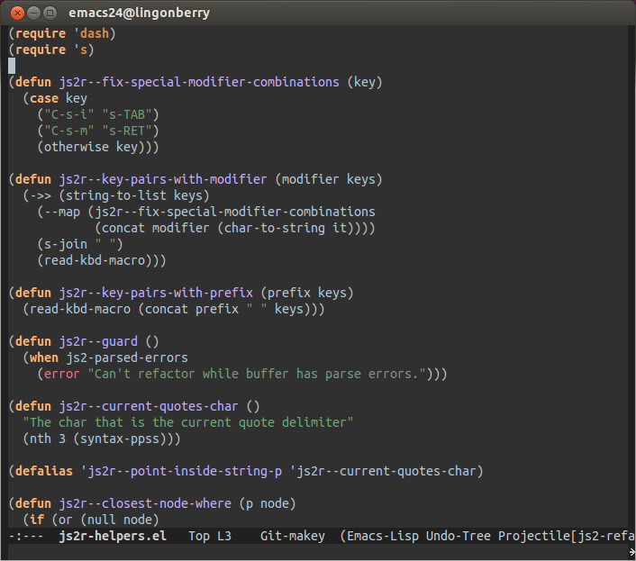

Niflheim theme for emacs
========================

A Niflheim theme for [Emacs](https://www.gnu.org/software/emacs/).

**This theme is not maintained anymore**.  I'm however actively maintaining [Zerodark](https://github.com/NicolasPetton/zerodark-theme), a theme inspired by Niflheim and other dark themes.

## Installation (with MELPA)

    M-x package-install RET niflheim-theme

## License

 

The Emacs port was written by [Nicolas Petton](http://nicolas-petton.fr) & [Benjamin Van Ryseghem](http://benjamin.vanryseghem.com).

Niflheim by <a xmlns:cc="http://creativecommons.org/ns#" href="http://benjamin.vanryseghem.com" property="cc:attributionName" rel="cc:attributionURL">Benjamin Van Ryseghem</a> is licensed under a <a rel="license" href="http://creativecommons.org/licenses/by-sa/4.0/">Creative Commons Attribution-ShareAlike 4.0 International License</a>. Based on a work at <a xmlns:dct="http://purl.org/dc/terms/" href="https://github.com/niflheim-theme" rel="dct:source">https://github.com/niflheim-theme</a>.
